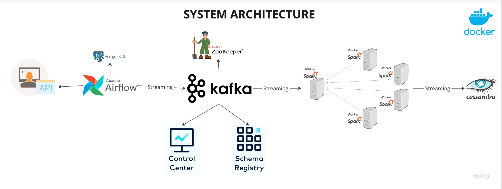

# Realtime Data Streaming | End-to-End Data Pipeline
_________________________________________________________________________________________________________________________________________

##### Table of Contents
_________________________________________________________________________________________________________________________________________

- Introduction
- System Architecture
- Technologies/Tools
- Additional Details

###### Introduction 
_________________________________________________________________________________________________________________________________________

This project functions as a detailed manual for constructing a complete data engineering pipeline, encompassing every step from data ingestion to processing and eventual storage. The implementation incorporates a robust technology stack featuring Apache Airflow, Python, Apache Kafka, Apache Zookeeper, Apache Spark, and Cassandra. To ensure ease of deployment and scalability, all components are containerized using Docker.

###### System Architecture
_________________________________________________________________________________________________________________________________________

The pipeline desgined with following components:

Data Source: We use <randomuser.me> API to generate random user data for our pipeline.
Apache Airflow: Responsible for orchestrating the pipeline and storing fetched data in a PostgreSQL database.
Apache Kafka and Zookeeper: Used for streaming data from PostgreSQL to the processing engine.
Control Center and Schema Registry: Helps in monitoring and schema management of our Kafka streams.
Apache Spark: For data processing with its master and worker nodes.
Cassandra: Where the processed data will be stored.

###### Technologies
_________________________________________________________________________________________________________________________________________

Apache Airflow = 2.6.0
Python >= 3.9
Apache Kafka 
Apache Zookeeper
Apache Spark = 3.4.1
Cassandra
PostgreSQL = 14.0
Docker
Java = 11.0.22 
Scala = 2.12

Note: Setup the environment according to given dependencies. 

###### Additional Details 
_________________________________________________________________________________________________________________________________________

- Integrate Jars: (https://mvnrepository.com/artifact)
  - spark-cassandra-connector_2.12:3.4.1
  - spark-sql-kafka-0-10_2.12:3.4.1
  - kafka-clients-3.4.1.jar